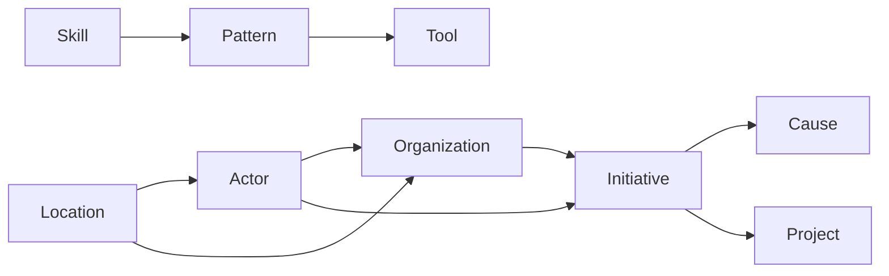

# ChangeMappers Open Data Quick Start Guide

## Welcome

This guide helps you quickly get started with ChangeMappers Open Data, whether you're a researcher, practitioner, developer, or data analyst.

## What is ChangeMappers Open Data?

ChangeMappers Open Data provides structured data about social change actors, organizations, initiatives, and the tools and patterns they use. Our goal is to make knowledge about effective change-making accessible and actionable.

## Data Overview

### Core Entities

| Entity | What It Represents | Example Use |
|--------|-------------------|-------------|
| Actor | Individuals and groups driving change | Find experts, partners |
| Organization | NGOs, foundations, corporations | Identify collaborators |
| Initiative | Coordinated change efforts | Discover campaigns |
| Cause | Issues being addressed | Explore problem areas |
| Pattern | Proven approaches | Learn what works |
| Story | Narrative documentation | Read case studies |
| Skill | Capabilities needed | Assess competencies |
| Tool | Resources for change | Find helpful tools |
| Location | Geographic context | Map activities |

### How Entities Connect



## Getting Data

### Download Options

1. **Full Dataset**: Download complete JSON/CSV exports
2. **Entity-Specific**: Download individual entity types
3. **API Access**: Query data programmatically
4. **Schema Files**: Access JSON Schema definitions

### File Structure

```
changemappers-opendata/
├── data/
│   ├── actors/
│   ├── organizations/
│   ├── initiatives/
│   ├── causes/
│   ├── patterns/
│   ├── stories/
│   ├── skills/
│   ├── tools/
│   └── locations/
├── schemas/
│   └── entities/
└── docs/
```

## Common Tasks

### 1. Find Organizations by Sector

```bash
# Using jq
cat data/organizations/*.json | jq '.[] | select(.sectors[]? == "environment")'
```

### 2. Find Initiatives by Location

```bash
# Using jq
cat data/initiatives/*.json | jq '.[] | select(.locations[]? == "location-uuid")'
```

### 3. Find Patterns by Category

```bash
# Using jq
cat data/patterns/*.json | jq '.[] | select(.category == "engagement")'
```

### 4. Map Actors to Organizations

```python
import json
import glob

# Load all actors
actors = []
for f in glob.glob('data/actors/*.json'):
    actors.extend(json.load(open(f)))

# Load all organizations
orgs = {}
for f in glob.glob('data/organizations/*.json'):
    for org in json.load(open(f)):
        orgs[org['id']] = org

# Map actors to their organizations
for actor in actors:
    for aff in actor.get('affiliations', []):
        org = orgs.get(aff['organization_id'])
        if org:
            print(f"{actor['name']} -> {org['name']}")
```

### 5. Find Tools for a Skill

```sql
-- If using a SQL database
SELECT t.name, t.description
FROM tools t
JOIN tool_skills ts ON t.id = ts.tool_id
JOIN skills s ON ts.skill_id = s.id
WHERE s.slug = 'facilitation';
```

## Understanding the Schema

### Required Fields

Every entity has these required fields:
- `id` - UUID identifier
- `slug` - URL-friendly name
- `name` or `title` - Display name
- `created_at` - Creation timestamp

### Optional Fields

Most entities have:
- `description` - Full description
- `tags` - Freeform categorization
- `metadata` - Additional custom data

### Reference Fields

Entities reference each other using UUID arrays:
- `locations` - Array of location UUIDs
- `initiatives` - Array of initiative UUIDs
- `organizations` - Array of organization UUIDs

## Taxonomy Quick Reference

### Domains (Areas of Work)

| Domain | Code |
|--------|------|
| Environment | ENV |
| Health | HEA |
| Education | EDU |
| Social Justice | SOC |
| Economic Development | ECO |
| Governance | GOV |

### Scales (Scope)

| Scale | Level |
|-------|-------|
| Global | 8 |
| International | 7 |
| National | 6 |
| Regional | 5 |
| Municipal | 4 |
| Community | 3 |
| Neighborhood | 2 |
| Household | 1 |

### Functions (Roles)

| Category | Examples |
|----------|----------|
| Governance | Decision Making, Oversight |
| Operations | Implementation, Management |
| Engagement | Organizing, Outreach |
| Learning | Research, Evaluation |
| Communication | Messaging, Media |
| Mobilization | Advocacy, Campaigning |
| Support | Technical, Administrative |
| Financing | Fundraising, Grantmaking |

## Data Quality

### Validation

All data is validated against JSON schemas:
- Field types are enforced
- Enum values are standardized
- Required fields are checked
- Patterns are validated

### Contributing Data

See [CONTRIBUTING_DATA.md](CONTRIBUTING_DATA.md) for guidelines on contributing.

## Tools for Working with Data

### Command Line

- `jq` - JSON processor
- `csvkit` - CSV toolkit
- `sqlite3` - SQLite database

### Programming Languages

- Python: `json`, `pandas`
- JavaScript: `JSON.parse()`
- R: `jsonlite`

### Visualization

- Tableau
- Power BI
- Observable
- D3.js

## Example Workflows

### Research Workflow

1. Download relevant entity data
2. Filter by domain/location of interest
3. Identify key actors and organizations
4. Examine patterns they use
5. Read related stories

### Analysis Workflow

1. Load data into analysis tool
2. Create relationship mappings
3. Analyze network structures
4. Identify patterns and gaps
5. Visualize findings

### Application Development

1. Review schema definitions
2. Design data integration
3. Implement API queries
4. Build user interface
5. Add visualization features

## Getting Help

### Documentation

- [Data Dictionary](DATA_DICTIONARY.md)
- [Entity Documentation](entities/)
- [Taxonomy Documentation](taxonomies/)

### Community

- GitHub Discussions
- Issue Tracker
- Community Chat

## Next Steps

1. Explore the [Data Dictionary](DATA_DICTIONARY.md)
2. Review specific [Entity Documentation](entities/)
3. Check the [Taxonomies](taxonomies/)
4. Start using the data!
