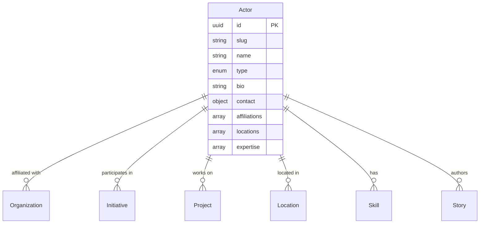

# Actor Entity

## Overview

An Actor represents an individual or entity that initiates, participates in, or influences change processes within the ChangeMappers ecosystem. Actors are central to understanding who drives change and how they interact with organizations, initiatives, and causes.

## Purpose

Actors serve as the primary agents of change in the data model, enabling:
- Tracking individual and collective participation in change efforts
- Mapping relationships between people and organizations
- Understanding expertise and skill distribution
- Analyzing networks of change-makers

## Fields

### Core Fields

| Field | Type | Required | Description |
|-------|------|----------|-------------|
| `id` | UUID | Yes | Unique identifier for the actor |
| `slug` | string | Yes | URL-friendly identifier (pattern: `^[a-z0-9]+(?:-[a-z0-9]+)*$`) |
| `name` | string | Yes | Full name of the actor (1-200 characters) |
| `type` | enum | Yes | Type of actor: `individual`, `collective`, `organization`, `network` |
| `created_at` | datetime | Yes | Creation timestamp |

### Optional Fields

| Field | Type | Description |
|-------|------|-------------|
| `bio` | string | Biographical description (max 2000 characters) |
| `contact` | object | Contact information including email, phone, website, social_media |
| `affiliations` | array | Organizations the actor is affiliated with (role, dates) |
| `locations` | array[UUID] | Geographic locations associated with the actor |
| `expertise` | array[enum] | Areas of expertise |
| `initiatives` | array[UUID] | Initiatives the actor is involved in |
| `projects` | array[UUID] | Projects the actor is involved in |
| `tags` | array[string] | Freeform tags (max 50 characters each) |
| `metadata` | object | Additional metadata |
| `updated_at` | datetime | Last update timestamp |

### Expertise Enum Values

- `community_organizing`
- `policy_advocacy`
- `research`
- `education`
- `technology`
- `finance`
- `communications`
- `legal`
- `health`
- `environment`
- `social_justice`
- `economics`
- `governance`
- `arts`
- `science`

## Relationships



## Example Record

```json
{
  "id": "550e8400-e29b-41d4-a716-446655440000",
  "slug": "jane-doe",
  "name": "Jane Doe",
  "type": "individual",
  "bio": "Community organizer and environmental activist with 15 years of experience.",
  "contact": {
    "email": "jane.doe@example.com",
    "phone": "+1-555-123-4567",
    "website": "https://janedoe.org",
    "social_media": {
      "twitter": "@janedoe",
      "linkedin": "jane-doe-12345"
    }
  },
  "affiliations": [
    {
      "organization_id": "550e8400-e29b-41d4-a716-446655440001",
      "role": "Director",
      "start_date": "2020-01-15"
    }
  ],
  "locations": ["550e8400-e29b-41d4-a716-446655440017"],
  "expertise": ["community_organizing", "environment", "policy_advocacy"],
  "initiatives": ["550e8400-e29b-41d4-a716-446655440002"],
  "tags": ["climate-justice", "grassroots"],
  "created_at": "2024-01-15T10:30:00Z",
  "updated_at": "2024-06-20T14:45:00Z"
}
```

## Query Examples

### Find all actors by expertise

```sql
SELECT * FROM actors 
WHERE expertise @> ARRAY['community_organizing']::text[];
```

### Find actors in a specific location

```sql
SELECT a.* FROM actors a
JOIN actor_locations al ON a.id = al.actor_id
WHERE al.location_id = 'location-uuid-here';
```

### Find actors by organization affiliation

```sql
SELECT a.* FROM actors a
JOIN affiliations af ON a.id = af.actor_id
WHERE af.organization_id = 'org-uuid-here'
AND (af.end_date IS NULL OR af.end_date > CURRENT_DATE);
```

## Validation Rules

1. **ID Format**: Must be a valid UUID v4
2. **Slug Format**: Lowercase alphanumeric with hyphens, no leading/trailing hyphens
3. **Name Length**: Between 1-200 characters
4. **Type**: Must be one of the predefined enum values
5. **Email**: Must be valid email format when provided
6. **Phone**: Must match pattern `^\+?[0-9\-\s]+$` when provided
7. **Website**: Must be valid URI when provided

## Taxonomies

- **Actor Types**: `individual`, `collective`, `organization`, `network`
- **Expertise Areas**: Standardized list of 15 expertise categories
- **Affiliation Roles**: Free-text with suggested standardization

## Usage Guidelines

1. **Individual vs. Collective**: Use `individual` for single persons, `collective` for informal groups
2. **Organization Actors**: Use the Organization entity for formal organizations
3. **Affiliations**: Include role and date range for proper tracking
4. **Locations**: Reference Location entity UUIDs for geographic data
5. **Expertise**: Use standardized enum values for consistency

## Related Entities

- [Organization](organization.md) - Formal organized entities
- [Initiative](initiative.md) - Coordinated change efforts
- [Project](project.md) - Specific project activities
- [Location](location.md) - Geographic locations
- [Skill](skill.md) - Capabilities and competencies
- [Story](story.md) - Narrative accounts
