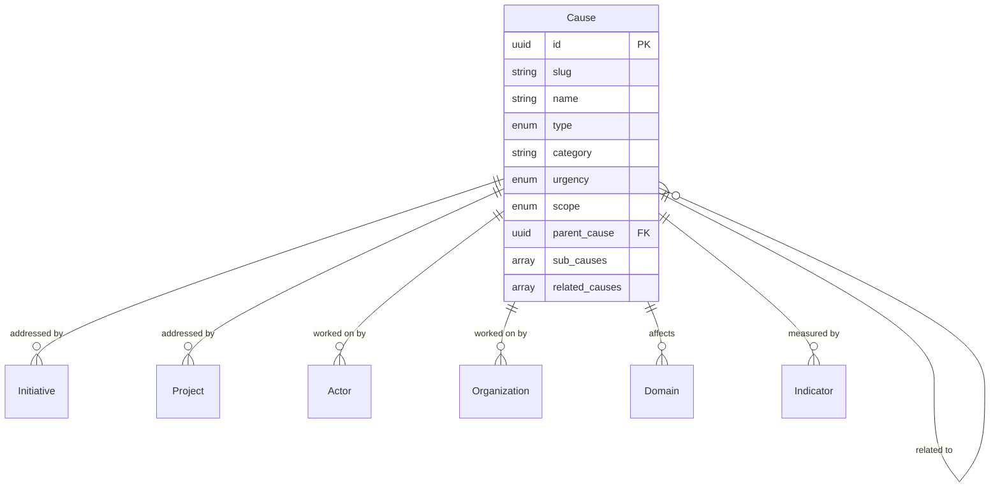

# Cause Entity

## Overview

A Cause represents a social, environmental, or economic issue that drives change efforts within the ChangeMappers ecosystem. Causes provide a way to categorize and understand the problems that initiatives and projects aim to address.

## Purpose

Causes enable:
- Categorizing and tracking issues being addressed
- Understanding relationships between related issues
- Measuring urgency and scope of problems
- Connecting initiatives to the issues they address

## Fields

### Core Fields

| Field | Type | Required | Description |
|-------|------|----------|-------------|
| `id` | UUID | Yes | Unique identifier for the cause |
| `slug` | string | Yes | URL-friendly identifier |
| `name` | string | Yes | Name of the cause (1-200 characters) |
| `created_at` | datetime | Yes | Creation timestamp |

### Optional Fields

| Field | Type | Description |
|-------|------|-------------|
| `description` | string | Detailed description (max 5000 characters) |
| `type` | enum | Primary type of cause |
| `category` | string | Broader category |
| `parent_cause` | UUID | Parent cause if this is a sub-cause |
| `sub_causes` | array[UUID] | Sub-causes or specific aspects |
| `related_causes` | array[UUID] | Related causes |
| `domains` | array[UUID] | Domains affected by this cause |
| `initiatives` | array[UUID] | Initiatives addressing this cause |
| `projects` | array[UUID] | Projects addressing this cause |
| `actors` | array[UUID] | Key actors working on this cause |
| `organizations` | array[UUID] | Organizations working on this cause |
| `indicators` | array[UUID] | Indicators measuring this cause |
| `urgency` | enum | Urgency level |
| `scope` | enum | Geographic scope of the cause |
| `tags` | array[string] | Freeform tags |
| `metadata` | object | Additional metadata |
| `updated_at` | datetime | Last update timestamp |

### Cause Types

| Type | Description |
|------|-------------|
| `environmental` | Environmental issues |
| `social` | Social issues |
| `economic` | Economic issues |
| `political` | Political issues |
| `cultural` | Cultural issues |
| `health` | Health issues |
| `educational` | Educational issues |
| `technological` | Technology-related issues |

### Urgency Levels

| Level | Description |
|-------|-------------|
| `low` | Low urgency |
| `medium` | Medium urgency |
| `high` | High urgency |
| `critical` | Critical urgency |

### Scope Values

| Scope | Description |
|-------|-------------|
| `local` | Local/community level |
| `regional` | Regional level |
| `national` | National level |
| `international` | International level |
| `global` | Global level |

## Relationships



## Example Record

```json
{
  "id": "550e8400-e29b-41d4-a716-446655440004",
  "slug": "climate-change",
  "name": "Climate Change",
  "description": "Addressing the global climate crisis through mitigation and adaptation strategies.",
  "type": "environmental",
  "category": "planetary_health",
  "parent_cause": null,
  "sub_causes": [
    "550e8400-e29b-41d4-a716-446655440005",
    "550e8400-e29b-41d4-a716-446655440006"
  ],
  "related_causes": [
    "550e8400-e29b-41d4-a716-446655440007",
    "550e8400-e29b-41d4-a716-446655440008"
  ],
  "domains": ["550e8400-e29b-41d4-a716-446655440021"],
  "initiatives": ["550e8400-e29b-41d4-a716-446655440002"],
  "projects": ["550e8400-e29b-41d4-a716-446655440010"],
  "actors": ["550e8400-e29b-41d4-a716-446655440000"],
  "organizations": ["550e8400-e29b-41d4-a716-446655440001"],
  "urgency": "critical",
  "scope": "global",
  "tags": ["climate", "environment", "global-warming", "sustainability"],
  "created_at": "2024-01-15T10:30:00Z",
  "updated_at": "2024-06-20T14:45:00Z"
}
```

## Query Examples

### Find causes by urgency

```sql
SELECT * FROM causes WHERE urgency = 'critical';
```

### Find causes by type

```sql
SELECT * FROM causes WHERE type = 'environmental';
```

### Find cause hierarchy

```sql
WITH RECURSIVE cause_tree AS (
  SELECT id, name, parent_cause, 1 as depth
  FROM causes WHERE id = 'cause-uuid-here'
  UNION ALL
  SELECT c.id, c.name, c.parent_cause, ct.depth + 1
  FROM causes c
  JOIN cause_tree ct ON c.parent_cause = ct.id
)
SELECT * FROM cause_tree ORDER BY depth;
```

### Find causes addressed by an organization

```sql
SELECT DISTINCT c.* FROM causes c
JOIN cause_organizations co ON c.id = co.cause_id
WHERE co.organization_id = 'org-uuid-here';
```

## Validation Rules

1. **ID Format**: Must be a valid UUID v4
2. **Slug Format**: Lowercase alphanumeric with hyphens
3. **Name Length**: Between 1-200 characters
4. **Type**: Must be one of the predefined enum values
5. **Urgency**: Must be one of: `low`, `medium`, `high`, `critical`
6. **Scope**: Must be one of: `local`, `regional`, `national`, `international`, `global`
7. **Parent Cause**: Cannot create circular references

## Taxonomies

- **Cause Types**: 8 primary cause categories
- **Urgency Levels**: 4 urgency classifications
- **Scope Values**: 5 geographic scope levels

## Usage Guidelines

1. **Hierarchy**: Use `parent_cause` for specific aspects of broader issues
2. **Related Causes**: Link causes that influence each other
3. **Urgency**: Assess urgency based on impact and timeframe
4. **Scope**: Indicate the geographic reach of the issue
5. **Type**: Choose the primary type, use tags for cross-cutting issues

## Related Entities

- [Initiative](initiative.md) - Efforts addressing the cause
- [Project](project.md) - Specific projects
- [Organization](organization.md) - Organizations working on the cause
- [Actor](actor.md) - Individuals working on the cause
- [Domain](../taxonomies/domains.md) - Affected domains
- [Indicator](indicator.md) - Measuring the cause
