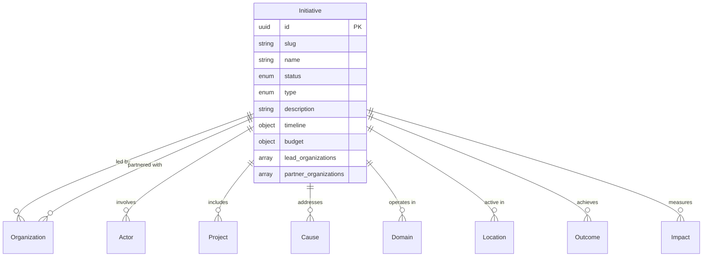

# Initiative Entity

## Overview

An Initiative represents a coordinated effort or campaign aimed at creating change. Initiatives typically involve multiple actors, organizations, and projects working together toward common goals.

## Purpose

Initiatives enable:
- Tracking large-scale change efforts spanning multiple projects
- Understanding coalition and network dynamics
- Measuring collective impact across projects
- Documenting timelines and milestones

## Fields

### Core Fields

| Field | Type | Required | Description |
|-------|------|----------|-------------|
| `id` | UUID | Yes | Unique identifier for the initiative |
| `slug` | string | Yes | URL-friendly identifier |
| `name` | string | Yes | Name of the initiative (1-200 characters) |
| `status` | enum | Yes | Current status of the initiative |
| `created_at` | datetime | Yes | Creation timestamp |

### Status Values

| Status | Description |
|--------|-------------|
| `planning` | Initiative is being planned |
| `active` | Initiative is actively running |
| `paused` | Initiative is temporarily paused |
| `completed` | Initiative has been completed |
| `archived` | Initiative is archived |

### Initiative Types

| Type | Description |
|------|-------------|
| `campaign` | Time-bound campaign effort |
| `coalition` | Coalition of organizations |
| `movement` | Social movement |
| `program` | Ongoing program |
| `project_cluster` | Cluster of related projects |
| `network` | Network initiative |

### Optional Fields

| Field | Type | Description |
|-------|------|-------------|
| `description` | string | Goals and approach description (max 5000 characters) |
| `type` | enum | Type of initiative |
| `lead_organizations` | array[UUID] | Organizations leading the initiative |
| `partner_organizations` | array[UUID] | Partner organizations |
| `actors` | array[UUID] | Key actors involved |
| `projects` | array[UUID] | Projects under this initiative |
| `causes` | array[UUID] | Causes the initiative addresses |
| `domains` | array[UUID] | Domains the initiative operates in |
| `locations` | array[UUID] | Geographic scope |
| `timeline` | object | Timeline with start_date, end_date, milestones |
| `outcomes` | array[UUID] | Expected or achieved outcomes |
| `impacts` | array[UUID] | Measured impacts |
| `resources` | array[UUID] | Resources available |
| `budget` | object | Budget information (total, currency, sources) |
| `tags` | array[string] | Freeform tags |
| `metadata` | object | Additional metadata |
| `updated_at` | datetime | Last update timestamp |

## Relationships



## Example Record

```json
{
  "id": "550e8400-e29b-41d4-a716-446655440002",
  "slug": "climate-justice-coalition",
  "name": "Climate Justice Coalition",
  "description": "A multi-stakeholder coalition working to advance climate justice policies at the municipal level.",
  "status": "active",
  "type": "coalition",
  "lead_organizations": ["550e8400-e29b-41d4-a716-446655440001"],
  "partner_organizations": [
    "550e8400-e29b-41d4-a716-446655440003",
    "550e8400-e29b-41d4-a716-446655440004"
  ],
  "actors": ["550e8400-e29b-41d4-a716-446655440000"],
  "projects": [
    "550e8400-e29b-41d4-a716-446655440010",
    "550e8400-e29b-41d4-a716-446655440011"
  ],
  "causes": ["550e8400-e29b-41d4-a716-446655440004"],
  "domains": ["550e8400-e29b-41d4-a716-446655440021"],
  "locations": ["550e8400-e29b-41d4-a716-446655440017"],
  "timeline": {
    "start_date": "2023-01-01",
    "end_date": "2025-12-31",
    "milestones": [
      {
        "date": "2023-06-01",
        "description": "Coalition formally established",
        "status": "achieved"
      },
      {
        "date": "2024-06-01",
        "description": "Policy framework drafted",
        "status": "achieved"
      },
      {
        "date": "2025-06-01",
        "description": "Municipal policy adoption",
        "status": "planned"
      }
    ]
  },
  "budget": {
    "total": 500000,
    "currency": "USD",
    "sources": [
      {"name": "Foundation Grants", "amount": 300000, "type": "grant"},
      {"name": "Individual Donations", "amount": 150000, "type": "donation"},
      {"name": "In-kind Contributions", "amount": 50000, "type": "donation"}
    ]
  },
  "outcomes": ["550e8400-e29b-41d4-a716-446655440030"],
  "impacts": ["550e8400-e29b-41d4-a716-446655440031"],
  "tags": ["climate", "justice", "municipal", "policy"],
  "created_at": "2023-01-15T10:30:00Z",
  "updated_at": "2024-06-20T14:45:00Z"
}
```

## Query Examples

### Find active initiatives

```sql
SELECT * FROM initiatives WHERE status = 'active';
```

### Find initiatives by cause

```sql
SELECT i.* FROM initiatives i
JOIN initiative_causes ic ON i.id = ic.initiative_id
WHERE ic.cause_id = 'cause-uuid-here';
```

### Find initiatives in a location

```sql
SELECT i.* FROM initiatives i
JOIN initiative_locations il ON i.id = il.initiative_id
WHERE il.location_id = 'location-uuid-here';
```

### Find initiatives by lead organization

```sql
SELECT i.* FROM initiatives i
JOIN initiative_leads il ON i.id = il.initiative_id
WHERE il.organization_id = 'org-uuid-here';
```

## Validation Rules

1. **ID Format**: Must be a valid UUID v4
2. **Slug Format**: Lowercase alphanumeric with hyphens
3. **Name Length**: Between 1-200 characters
4. **Status**: Must be one of the predefined enum values
5. **Timeline Dates**: End date must be after start date if both provided
6. **Budget Currency**: Must be 3-letter ISO currency code
7. **Milestone Status**: Must be `planned`, `achieved`, or `missed`

## Taxonomies

- **Status**: 5 lifecycle stages
- **Initiative Types**: 6 types of initiatives
- **Milestone Status**: 3 milestone states

## Usage Guidelines

1. **Type Selection**: Use `coalition` for multi-org efforts, `campaign` for time-bound efforts
2. **Lead vs Partner**: Lead organizations have primary responsibility
3. **Timeline**: Include key milestones for progress tracking
4. **Budget**: Use consistent currency across all amounts
5. **Status Updates**: Keep status current as initiative progresses

## Related Entities

- [Organization](organization.md) - Leading and partner organizations
- [Actor](actor.md) - Key individuals involved
- [Project](project.md) - Specific project activities
- [Cause](cause.md) - Issues addressed
- [Location](location.md) - Geographic scope
- [Outcome](outcome.md) - Expected/achieved outcomes
- [Impact](impact.md) - Measured impacts
- [Domain](../taxonomies/domains.md) - Areas of focus
