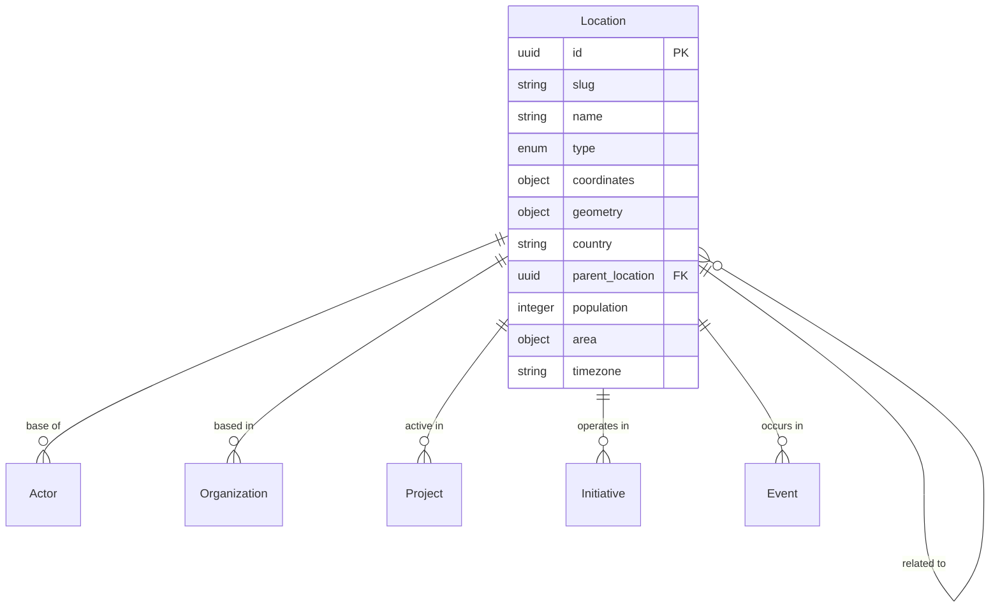

# Location Entity

## Overview

A Location represents a geographic place or area relevant to change-making activities within the ChangeMappers ecosystem. Locations provide geographic context for actors, organizations, initiatives, and projects.

## Purpose

Locations enable:
- Geographic mapping of change activities
- Understanding regional patterns and clusters
- Analyzing geographic scope of initiatives
- Connecting entities to their places of operation

## Fields

### Core Fields

| Field | Type | Required | Description |
|-------|------|----------|-------------|
| `id` | UUID | Yes | Unique identifier for the location |
| `slug` | string | Yes | URL-friendly identifier |
| `name` | string | Yes | Name of the location (1-200 characters) |
| `type` | enum | Yes | Type of location |
| `created_at` | datetime | Yes | Creation timestamp |

### Location Types

| Type | Description |
|------|-------------|
| `city` | City or town |
| `region` | Region or province |
| `country` | Country |
| `neighborhood` | Neighborhood or district |
| `district` | Administrative district |
| `province` | Province |
| `state` | State |
| `continent` | Continent |
| `community` | Community (informal) |
| `indigenous_territory` | Indigenous territory |
| `ecosystem` | Ecosystem or biome |
| `watershed` | Watershed or river basin |

### Optional Fields

| Field | Type | Description |
|-------|------|-------------|
| `description` | string | Description of the location (max 2000 characters) |
| `coordinates` | object | Geographic coordinates (latitude, longitude) |
| `geometry` | object | GeoJSON geometry for boundaries |
| `country` | string | ISO 3166-1 alpha-2 country code |
| `country_name` | string | Full country name |
| `region` | string | Region/state/province |
| `parent_location` | UUID | Parent location (e.g., country for a city) |
| `child_locations` | array[UUID] | Child locations |
| `population` | integer | Population if applicable |
| `area` | object | Area information (value, unit) |
| `timezone` | string | Timezone |
| `languages_spoken` | array[string] | Languages spoken (ISO 639-1 codes) |
| `indigenous_peoples` | array[string] | Indigenous peoples/territories |
| `climate` | string | Climate classification |
| `industries` | array[string] | Major industries |
| `actors` | array[UUID] | Actors based in this location |
| `organizations` | array[UUID] | Organizations based here |
| `projects` | array[UUID] | Projects in this location |
| `initiatives` | array[UUID] | Initiatives in this location |
| `events` | array[UUID] | Events in this location |
| `related_locations` | array[UUID] | Related locations |
| `tags` | array[string] | Freeform tags |
| `metadata` | object | Additional metadata |
| `updated_at` | datetime | Last update timestamp |

### Area Units

- `km2` - Square kilometers
- `mi2` - Square miles
- `ha` - Hectares
- `acres` - Acres

## Relationships



## Example Record

```json
{
  "id": "550e8400-e29b-41d4-a716-446655440017",
  "slug": "buenos-aires-argentina",
  "name": "Buenos Aires",
  "type": "city",
  "description": "Capital and largest city of Argentina, located on the western shore of the Río de la Plata.",
  "coordinates": {
    "latitude": -34.6037,
    "longitude": -58.3816
  },
  "geometry": {
    "type": "Polygon",
    "coordinates": [[[...]]]
  },
  "country": "AR",
  "country_name": "Argentina",
  "region": "Buenos Aires",
  "parent_location": "550e8400-e29b-41d4-a716-446655440070",
  "population": 15000000,
  "area": {
    "value": 203,
    "unit": "km2"
  },
  "timezone": "America/Argentina/Buenos_Aires",
  "languages_spoken": ["es"],
  "indigenous_peoples": ["Querandí", "Guaraní"],
  "climate": "Humid subtropical",
  "industries": ["Services", "Manufacturing", "Technology", "Tourism"],
  "actors": ["550e8400-e29b-41d4-a716-446655440000"],
  "organizations": ["550e8400-e29b-41d4-a716-446655440001"],
  "projects": ["550e8400-e29b-41d4-a716-446655440010"],
  "initiatives": ["550e8400-e29b-41d4-a716-446655440002"],
  "tags": ["capital", "south-america", "urban", "metropolitan"],
  "created_at": "2024-01-15T10:30:00Z",
  "updated_at": "2024-06-20T14:45:00Z"
}
```

## Query Examples

### Find locations by type

```sql
SELECT * FROM locations WHERE type = 'city';
```

### Find locations by country

```sql
SELECT * FROM locations WHERE country = 'AR';
```

### Find locations within a radius

```sql
SELECT * FROM locations
WHERE ST_DWithin(
  ST_MakePoint(coordinates->>'longitude', coordinates->>'latitude')::geography,
  ST_MakePoint(-58.38, -34.60)::geography,
  50000
);
```

### Find location hierarchy

```sql
WITH RECURSIVE location_tree AS (
  SELECT id, name, parent_location, 1 as depth
  FROM locations WHERE id = 'location-uuid-here'
  UNION ALL
  SELECT l.id, l.name, l.parent_location, lt.depth + 1
  FROM locations l
  JOIN location_tree lt ON l.parent_location = lt.id
)
SELECT * FROM location_tree ORDER BY depth;
```

### Find locations with projects

```sql
SELECT DISTINCT l.* FROM locations l
JOIN location_projects lp ON l.id = lp.location_id;
```

## Validation Rules

1. **ID Format**: Must be a valid UUID v4
2. **Slug Format**: Lowercase alphanumeric with hyphens
3. **Name Length**: Between 1-200 characters
4. **Type**: Must be one of the predefined enum values
5. **Coordinates**: Latitude between -90 and 90, longitude between -180 and 180
6. **Country Code**: Must be valid ISO 3166-1 alpha-2 if provided
7. **Population**: Must be non-negative if provided
8. **Parent Location**: Cannot create circular references

## Taxonomies

- **Location Types**: 12 location type categories
- **Area Units**: 4 measurement units
- **Country Codes**: ISO 3166-1 standard

## Usage Guidelines

1. **Hierarchy**: Use `parent_location` for administrative hierarchy
2. **Coordinates**: Provide centroid for point locations
3. **Geometry**: Use GeoJSON for boundaries and polygons
4. **Indigenous Peoples**: Document traditional territories respectfully
5. **Related Locations**: Link neighboring or connected areas

## Related Entities

- [Actor](actor.md) - Actors based in the location
- [Organization](organization.md) - Organizations based here
- [Project](project.md) - Projects active in the location
- [Initiative](initiative.md) - Initiatives operating here
- [Event](event.md) - Events occurring in the location
- [Story](story.md) - Stories set in the location
