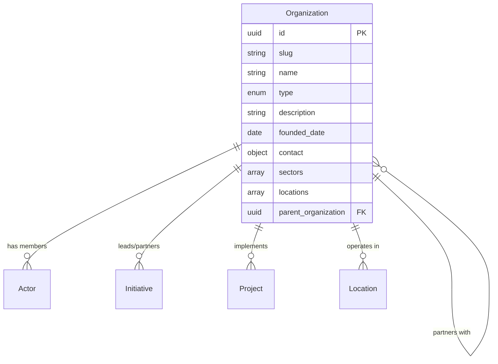

# Organization Entity

## Overview

An Organization represents a structured entity that operates within the ChangeMappers ecosystem. This includes NGOs, corporations, government bodies, grassroots groups, foundations, cooperatives, and other formal or semi-formal collective entities.

## Purpose

Organizations are key actors in change processes, enabling:
- Mapping institutional involvement in initiatives and projects
- Understanding organizational networks and partnerships
- Tracking funding flows and resource allocation
- Analyzing organizational hierarchies and structures

## Fields

### Core Fields

| Field | Type | Required | Description |
|-------|------|----------|-------------|
| `id` | UUID | Yes | Unique identifier for the organization |
| `slug` | string | Yes | URL-friendly identifier (pattern: `^[a-z0-9]+(?:-[a-z0-9]+)*$`) |
| `name` | string | Yes | Official name of the organization (1-200 characters) |
| `type` | enum | Yes | Type of organization |
| `created_at` | datetime | Yes | Creation timestamp |

### Organization Types

| Type | Description |
|------|-------------|
| `ngo` | Non-governmental organization |
| `nonprofit` | Nonprofit organization |
| `corporation` | For-profit corporation |
| `government` | Government body or agency |
| `grassroots` | Grassroots community organization |
| `network` | Network or coalition |
| `foundation` | Philanthropic foundation |
| `cooperative` | Cooperative enterprise |
| `community_organization` | Local community organization |
| `academic` | Academic institution |
| `research_institute` | Research institute |

### Optional Fields

| Field | Type | Description |
|-------|------|-------------|
| `description` | string | Mission and activities description (max 5000 characters) |
| `founded_date` | date | Date the organization was founded |
| `contact` | object | Contact information (email, phone, website, address) |
| `locations` | array[UUID] | Geographic locations of operation |
| `sectors` | array[enum] | Sectors of operation |
| `initiatives` | array[UUID] | Initiatives the organization leads/participates in |
| `projects` | array[UUID] | Projects the organization is involved in |
| `members` | array[UUID] | Actor members of the organization |
| `parent_organization` | UUID | Parent organization ID if subsidiary |
| `child_organizations` | array[UUID] | Child/subsidiary organizations |
| `partners` | array[UUID] | Partner organizations |
| `funding_sources` | array[object] | Sources of funding |
| `tags` | array[string] | Freeform tags |
| `metadata` | object | Additional metadata |
| `updated_at` | datetime | Last update timestamp |

### Sector Enum Values

- `environment`
- `education`
- `health`
- `social_justice`
- `economic_development`
- `governance`
- `arts_culture`
- `technology`
- `agriculture`
- `energy`
- `housing`
- `transportation`

### Funding Source Types

- `grant`
- `donation`
- `investment`
- `government`
- `earned_income`

## Relationships



## Example Record

```json
{
  "id": "550e8400-e29b-41d4-a716-446655440001",
  "slug": "green-planet-initiative",
  "name": "Green Planet Initiative",
  "type": "ngo",
  "description": "A nonprofit organization dedicated to environmental conservation and sustainable development.",
  "founded_date": "2010-03-15",
  "contact": {
    "email": "info@greenplanet.org",
    "phone": "+1-555-987-6543",
    "website": "https://greenplanet.org",
    "address": {
      "street": "123 Eco Street",
      "city": "San Francisco",
      "state": "CA",
      "postal_code": "94102",
      "country": "US"
    }
  },
  "locations": ["550e8400-e29b-41d4-a716-446655440017"],
  "sectors": ["environment", "energy", "agriculture"],
  "initiatives": ["550e8400-e29b-41d4-a716-446655440002"],
  "members": ["550e8400-e29b-41d4-a716-446655440000"],
  "partners": ["550e8400-e29b-41d4-a716-446655440003"],
  "funding_sources": [
    {
      "source": "Ford Foundation",
      "type": "grant",
      "percentage": 40
    },
    {
      "source": "Individual Donations",
      "type": "donation",
      "percentage": 35
    },
    {
      "source": "Consulting Services",
      "type": "earned_income",
      "percentage": 25
    }
  ],
  "tags": ["environmental", "nonprofit", "sustainability"],
  "created_at": "2024-01-15T10:30:00Z",
  "updated_at": "2024-06-20T14:45:00Z"
}
```

## Query Examples

### Find organizations by sector

```sql
SELECT * FROM organizations 
WHERE sectors @> ARRAY['environment']::text[];
```

### Find organizations by type

```sql
SELECT * FROM organizations 
WHERE type = 'ngo';
```

### Find organization hierarchy

```sql
WITH RECURSIVE org_tree AS (
  SELECT id, name, parent_organization, 1 as depth
  FROM organizations WHERE id = 'org-uuid-here'
  UNION ALL
  SELECT o.id, o.name, o.parent_organization, ot.depth + 1
  FROM organizations o
  JOIN org_tree ot ON o.parent_organization = ot.id
)
SELECT * FROM org_tree ORDER BY depth;
```

### Find partner networks

```sql
SELECT o1.name as org1, o2.name as org2
FROM organizations o1
JOIN organization_partners op ON o1.id = op.org_id
JOIN organizations o2 ON op.partner_id = o2.id;
```

## Validation Rules

1. **ID Format**: Must be a valid UUID v4
2. **Slug Format**: Lowercase alphanumeric with hyphens
3. **Name Length**: Between 1-200 characters
4. **Type**: Must be one of the predefined enum values
5. **Founded Date**: Must be a valid date, not in the future
6. **Funding Percentage**: Must be between 0-100 if provided
7. **Parent/Child**: Cannot create circular references

## Taxonomies

- **Organization Types**: 11 standardized types
- **Sectors**: 12 sector categories
- **Funding Source Types**: 5 funding type categories

## Usage Guidelines

1. **Type Selection**: Choose the most specific type that fits
2. **Hierarchy**: Use `parent_organization` for subsidiaries/chapters
3. **Partners**: Use `partners` array for formal partnerships
4. **Funding**: Sum of percentages should ideally equal 100
5. **Sectors**: Use multiple sectors for cross-cutting work

## Related Entities

- [Actor](actor.md) - Individual members and staff
- [Initiative](initiative.md) - Coordinated change efforts
- [Project](project.md) - Specific project activities
- [Location](location.md) - Geographic locations
- [Cause](cause.md) - Issues addressed
- [Tool](tool.md) - Tools maintained by organization
