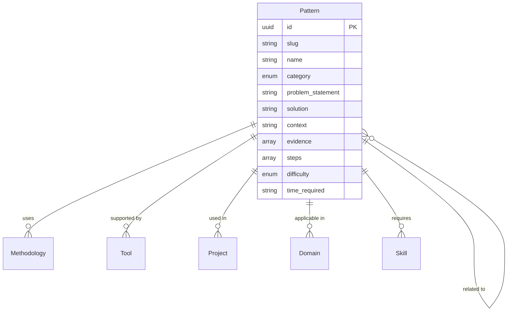

# Pattern Entity

## Overview

A Pattern represents a reusable solution or approach that has been demonstrated to be effective in addressing specific challenges within change processes. Patterns capture proven practices that can be adapted and applied across different contexts.

## Purpose

Patterns enable:
- Sharing and discovering effective change-making approaches
- Understanding what works in different contexts
- Building on proven solutions rather than reinventing
- Connecting practitioners with successful methodologies

## Fields

### Core Fields

| Field | Type | Required | Description |
|-------|------|----------|-------------|
| `id` | UUID | Yes | Unique identifier for the pattern |
| `slug` | string | Yes | URL-friendly identifier |
| `name` | string | Yes | Name of the pattern (1-200 characters) |
| `category` | enum | Yes | Category of the pattern |
| `created_at` | datetime | Yes | Creation timestamp |

### Pattern Categories

| Category | Description |
|----------|-------------|
| `engagement` | Community and stakeholder engagement |
| `governance` | Decision-making and governance |
| `communication` | Communication and messaging |
| `resource_mobilization` | Resource and funding mobilization |
| `capacity_building` | Skills and capacity development |
| `advocacy` | Advocacy and policy change |
| `monitoring` | Monitoring and evaluation |
| `collaboration` | Collaboration and partnership |
| `decision_making` | Decision-making processes |
| `implementation` | Implementation approaches |

### Optional Fields

| Field | Type | Description |
|-------|------|-------------|
| `description` | string | Detailed description (max 5000 characters) |
| `problem_statement` | string | The problem this pattern addresses (max 2000 characters) |
| `solution` | string | How the pattern solves the problem (max 5000 characters) |
| `context` | string | Contexts where pattern is applicable (max 2000 characters) |
| `evidence` | array[object] | Evidence of effectiveness |
| `prerequisites` | array[string] | Prerequisites for applying this pattern |
| `steps` | array[object] | Implementation steps (order, description, duration, resources) |
| `related_patterns` | array[UUID] | Related patterns |
| `related_methods` | array[UUID] | Related methodologies |
| `related_tools` | array[UUID] | Tools that support this pattern |
| `projects_using` | array[UUID] | Projects using this pattern |
| `domains` | array[UUID] | Domains where applicable |
| `difficulty` | enum | Difficulty level to implement |
| `time_required` | string | Typical time required |
| `tags` | array[string] | Freeform tags |
| `metadata` | object | Additional metadata |
| `updated_at` | datetime | Last update timestamp |

### Difficulty Levels

| Level | Description |
|-------|-------------|
| `beginner` | No prior experience needed |
| `intermediate` | Some experience helpful |
| `advanced` | Significant experience required |
| `expert` | Expert-level skills needed |

### Evidence Types

| Type | Description |
|------|-------------|
| `case_study` | Case study documentation |
| `research` | Academic research |
| `testimonial` | Practitioner testimonial |
| `data` | Quantitative data |

## Relationships



## Example Record

```json
{
  "id": "550e8400-e29b-41d4-a716-446655440005",
  "slug": "community-asset-mapping",
  "name": "Community Asset Mapping",
  "description": "A participatory process for identifying and mapping existing community strengths, resources, and capacities.",
  "category": "engagement",
  "problem_statement": "Communities often lack awareness of their own strengths and resources, leading to dependency on external support.",
  "solution": "Facilitate a structured process where community members identify, document, and map their existing assets including skills, organizations, physical spaces, and networks.",
  "context": "Applicable in community development, capacity assessment, and strategic planning contexts. Works best with established communities willing to share information.",
  "evidence": [
    {
      "type": "case_study",
      "description": "Successfully used in 50+ communities across Latin America",
      "source": "Community Development Journal",
      "url": "https://example.org/case-study"
    }
  ],
  "prerequisites": [
    "Community trust and willingness to participate",
    "Facilitator with local knowledge",
    "Basic mapping tools or materials"
  ],
  "steps": [
    {
      "order": 1,
      "description": "Introduce the concept and purpose to community leaders",
      "duration": "1-2 hours",
      "resources_needed": ["Meeting space", "Presentation materials"]
    },
    {
      "order": 2,
      "description": "Conduct community mapping workshop",
      "duration": "4-6 hours",
      "resources_needed": ["Large paper/maps", "Markers", "Sticky notes"]
    },
    {
      "order": 3,
      "description": "Document and digitize findings",
      "duration": "1-2 weeks",
      "resources_needed": ["Digital mapping tool", "Camera"]
    }
  ],
  "related_patterns": [
    "550e8400-e29b-41d4-a716-446655440009"
  ],
  "related_tools": ["550e8400-e29b-41d4-a716-446655440008"],
  "domains": ["550e8400-e29b-41d4-a716-446655440021"],
  "difficulty": "intermediate",
  "time_required": "2-4 weeks",
  "tags": ["participatory", "assets", "community", "mapping"],
  "created_at": "2024-01-15T10:30:00Z",
  "updated_at": "2024-06-20T14:45:00Z"
}
```

## Query Examples

### Find patterns by category

```sql
SELECT * FROM patterns WHERE category = 'engagement';
```

### Find patterns by difficulty

```sql
SELECT * FROM patterns WHERE difficulty = 'beginner';
```

### Find patterns for a domain

```sql
SELECT p.* FROM patterns p
JOIN pattern_domains pd ON p.id = pd.pattern_id
WHERE pd.domain_id = 'domain-uuid-here';
```

### Search patterns by problem

```sql
SELECT * FROM patterns
WHERE problem_statement ILIKE '%community%';
```

## Validation Rules

1. **ID Format**: Must be a valid UUID v4
2. **Slug Format**: Lowercase alphanumeric with hyphens
3. **Name Length**: Between 1-200 characters
4. **Category**: Must be one of the predefined enum values
5. **Difficulty**: Must be one of: `beginner`, `intermediate`, `advanced`, `expert`
6. **Steps Order**: Step order must start at 1 and be sequential

## Taxonomies

- **Pattern Categories**: 10 categories of patterns
- **Difficulty Levels**: 4 difficulty classifications
- **Evidence Types**: 4 types of evidence

## Usage Guidelines

1. **Problem Statement**: Clearly articulate the specific problem addressed
2. **Solution**: Provide actionable, implementable guidance
3. **Context**: Specify when and where the pattern works best
4. **Evidence**: Include multiple types of evidence when available
5. **Steps**: Number steps sequentially with realistic time estimates

## Related Entities

- [Tool](tool.md) - Tools that support pattern implementation
- [Skill](skill.md) - Skills required for implementation
- [Project](project.md) - Projects using the pattern
- [Domain](../taxonomies/domains.md) - Applicable domains
- [Methodology](methodology.md) - Related methodologies
