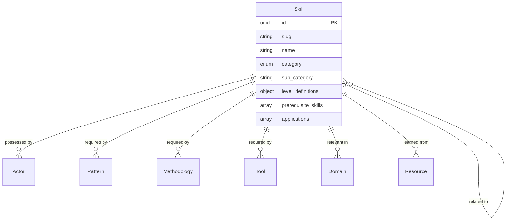

# Skill Entity

## Overview

A Skill represents a capability or competency that actors can develop and apply in change-making activities within the ChangeMappers ecosystem. Skills help match needs with capabilities and support capacity building.

## Purpose

Skills enable:
- Assessing and tracking actor capabilities
- Matching skills to project needs
- Identifying training and development needs
- Understanding skill requirements for patterns and tools

## Fields

### Core Fields

| Field | Type | Required | Description |
|-------|------|----------|-------------|
| `id` | UUID | Yes | Unique identifier for the skill |
| `slug` | string | Yes | URL-friendly identifier |
| `name` | string | Yes | Name of the skill (1-200 characters) |
| `category` | enum | Yes | Category of the skill |
| `created_at` | datetime | Yes | Creation timestamp |

### Skill Categories

| Category | Description |
|----------|-------------|
| `communication` | Communication skills |
| `leadership` | Leadership skills |
| `technical` | Technical skills |
| `analytical` | Analytical skills |
| `interpersonal` | Interpersonal skills |
| `organizational` | Organizational skills |
| `creative` | Creative skills |
| `strategic` | Strategic skills |
| `advocacy` | Advocacy skills |
| `research` | Research skills |

### Optional Fields

| Field | Type | Description |
|-------|------|-------------|
| `description` | string | Description of the skill (max 2000 characters) |
| `sub_category` | string | Sub-category for specific classification |
| `level_definitions` | object | Definitions for skill levels (beginner, intermediate, advanced, expert) |
| `learning_resources` | array[UUID] | Resources for developing this skill |
| `related_skills` | array[UUID] | Related skills |
| `prerequisite_skills` | array[UUID] | Skills that are prerequisites |
| `applications` | array[string] | How this skill can be applied |
| `assessment_criteria` | array[string] | Criteria for assessing skill level |
| `domains` | array[UUID] | Domains where this skill is relevant |
| `patterns` | array[UUID] | Patterns that use this skill |
| `methods` | array[UUID] | Methodologies that require this skill |
| `actors_with_skill` | array[object] | Actors who have this skill (actor_id, level, verified) |
| `tags` | array[string] | Freeform tags |
| `metadata` | object | Additional metadata |
| `updated_at` | datetime | Last update timestamp |

### Skill Levels

| Level | Description |
|-------|-------------|
| `beginner` | Basic understanding and awareness |
| `intermediate` | Can apply with guidance |
| `advanced` | Can apply independently |
| `expert` | Can teach and mentor others |

## Relationships



## Example Record

```json
{
  "id": "550e8400-e29b-41d4-a716-446655440007",
  "slug": "facilitation",
  "name": "Group Facilitation",
  "description": "The ability to guide groups through processes to achieve productive outcomes.",
  "category": "interpersonal",
  "sub_category": "meeting_facilitation",
  "level_definitions": {
    "beginner": "Can support facilitation with guidance; understands basic meeting structures",
    "intermediate": "Can independently facilitate small group meetings; handles common challenges",
    "advanced": "Facilitates complex multi-stakeholder processes; adapts approaches to context",
    "expert": "Designs facilitation processes; trains others; handles high-conflict situations"
  },
  "learning_resources": [
    "550e8400-e29b-41d4-a716-446655440050"
  ],
  "related_skills": [
    "550e8400-e29b-41d4-a716-446655440051"
  ],
  "prerequisite_skills": [
    "550e8400-e29b-41d4-a716-446655440052"
  ],
  "applications": [
    "Community meetings",
    "Strategic planning sessions",
    "Conflict resolution",
    "Workshop delivery"
  ],
  "assessment_criteria": [
    "Can design meeting agendas",
    "Manages group dynamics effectively",
    "Ensures inclusive participation",
    "Achieves stated meeting objectives"
  ],
  "domains": ["550e8400-e29b-41d4-a716-446655440021"],
  "patterns": ["550e8400-e29b-41d4-a716-446655440005"],
  "actors_with_skill": [
    {
      "actor_id": "550e8400-e29b-41d4-a716-446655440000",
      "level": "advanced",
      "verified": true
    }
  ],
  "tags": ["facilitation", "meetings", "group-process", "participation"],
  "created_at": "2024-01-15T10:30:00Z",
  "updated_at": "2024-06-20T14:45:00Z"
}
```

## Query Examples

### Find skills by category

```sql
SELECT * FROM skills WHERE category = 'interpersonal';
```

### Find skills for a pattern

```sql
SELECT s.* FROM skills s
JOIN pattern_skills ps ON s.id = ps.skill_id
WHERE ps.pattern_id = 'pattern-uuid-here';
```

### Find actors with a skill

```sql
SELECT a.* FROM actors a
JOIN actor_skills sk ON a.id = sk.actor_id
WHERE sk.skill_id = 'skill-uuid-here'
AND sk.level IN ('advanced', 'expert');
```

### Find prerequisite chain

```sql
WITH RECURSIVE skill_tree AS (
  SELECT id, name, array[]::uuid[] as path
  FROM skills WHERE id = 'skill-uuid-here'
  UNION ALL
  SELECT s.id, s.name, st.path || s.id
  FROM skills s
  JOIN skill_tree st ON s.id IN (
    SELECT unnest(prerequisite_skills) FROM skills WHERE id = st.id
  )
  WHERE NOT s.id = ANY(st.path)
)
SELECT * FROM skill_tree;
```

## Validation Rules

1. **ID Format**: Must be a valid UUID v4
2. **Slug Format**: Lowercase alphanumeric with hyphens
3. **Name Length**: Between 1-200 characters
4. **Category**: Must be one of the predefined enum values
5. **Level**: When actors_with_skill is used, level must be valid enum
6. **Prerequisites**: Cannot create circular prerequisite chains

## Taxonomies

- **Skill Categories**: 10 categories of skills
- **Skill Levels**: 4 proficiency levels
- **Verification Status**: Boolean for skill verification

## Usage Guidelines

1. **Level Definitions**: Provide clear descriptions for each level
2. **Prerequisites**: List foundational skills needed
3. **Applications**: Describe concrete use cases
4. **Assessment Criteria**: Make criteria observable and measurable
5. **Verification**: Use verification for confirmed skills

## Related Entities

- [Actor](actor.md) - Actors possessing the skill
- [Pattern](pattern.md) - Patterns requiring the skill
- [Tool](tool.md) - Tools requiring the skill
- [Domain](../taxonomies/domains.md) - Relevant domains
- [Methodology](methodology.md) - Methods requiring the skill
- [Resource](resource.md) - Learning resources
