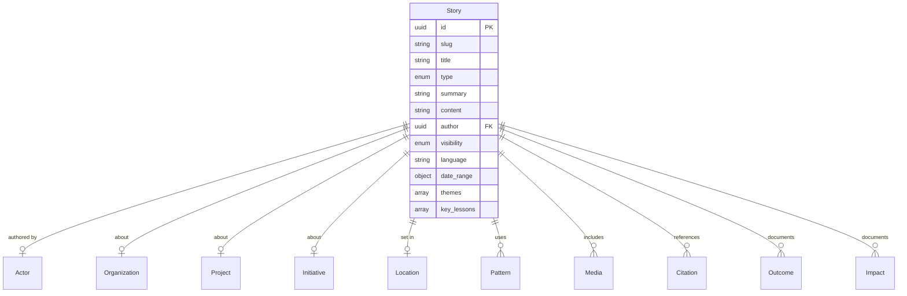

# Story Entity

## Overview

A Story represents a narrative account of change experiences, lessons learned, or impact documentation within the ChangeMappers ecosystem. Stories capture qualitative insights that complement quantitative data.

## Purpose

Stories enable:
- Documenting lived experiences and lessons learned
- Sharing impact narratives from practitioners
- Capturing qualitative data about change processes
- Building collective knowledge through storytelling

## Fields

### Core Fields

| Field | Type | Required | Description |
|-------|------|----------|-------------|
| `id` | UUID | Yes | Unique identifier for the story |
| `slug` | string | Yes | URL-friendly identifier |
| `title` | string | Yes | Title of the story (1-200 characters) |
| `type` | enum | Yes | Type of story |
| `created_at` | datetime | Yes | Creation timestamp |

### Story Types

| Type | Description |
|------|-------------|
| `case_study` | Detailed case study |
| `testimonial` | Personal testimonial |
| `lesson_learned` | Lessons learned documentation |
| `impact_story` | Impact narrative |
| `personal_narrative` | Personal story |
| `organizational_profile` | Organization story |
| `project_documentation` | Project story |

### Optional Fields

| Field | Type | Description |
|-------|------|-------------|
| `summary` | string | Brief summary (max 500 characters) |
| `content` | string | Full story content in markdown (max 50000 characters) |
| `author` | UUID | Actor who authored the story |
| `organization` | UUID | Organization associated with the story |
| `project` | UUID | Project the story is about |
| `initiative` | UUID | Initiative the story is about |
| `location` | UUID | Geographic location of the story |
| `date_range` | object | Time period covered (start_date, end_date) |
| `themes` | array[string] | Themes covered |
| `key_lessons` | array[string] | Key lessons learned |
| `challenges` | array[string] | Challenges encountered |
| `successes` | array[string] | Successes achieved |
| `patterns_used` | array[UUID] | Patterns mentioned or used |
| `media` | array[UUID] | Associated media files |
| `citations` | array[UUID] | References and citations |
| `outcomes` | array[UUID] | Outcomes documented |
| `impacts` | array[UUID] | Impacts documented |
| `visibility` | enum | Visibility level |
| `language` | string | ISO 639-1 language code |
| `tags` | array[string] | Freeform tags |
| `metadata` | object | Additional metadata |
| `updated_at` | datetime | Last update timestamp |
| `published_at` | datetime | Publication timestamp |

### Visibility Levels

| Level | Description |
|-------|-------------|
| `public` | Visible to all |
| `private` | Visible to author only |
| `restricted` | Visible to specific groups |

## Relationships



## Example Record

```json
{
  "id": "550e8400-e29b-41d4-a716-446655440006",
  "slug": "how-we-transformed-our-neighborhood",
  "title": "How We Transformed Our Neighborhood Through Collective Action",
  "type": "case_study",
  "summary": "A community in Buenos Aires organized to transform vacant lots into urban gardens, improving food security and social cohesion.",
  "content": "# The Beginning\n\nIn 2020, our neighborhood faced significant challenges...\n\n## Key Actions\n\nWe started by...\n\n## Results\n\nAfter two years...",
  "author": "550e8400-e29b-41d4-a716-446655440000",
  "organization": "550e8400-e29b-41d4-a716-446655440001",
  "project": "550e8400-e29b-41d4-a716-446655440010",
  "location": "550e8400-e29b-41d4-a716-446655440017",
  "date_range": {
    "start_date": "2020-03-01",
    "end_date": "2022-12-31"
  },
  "themes": ["community_organizing", "urban_agriculture", "food_security"],
  "key_lessons": [
    "Start small and build momentum",
    "Engage diverse stakeholders early",
    "Document progress to maintain motivation"
  ],
  "challenges": [
    "Initial resistance from some residents",
    "Limited funding for materials",
    "Water access during dry season"
  ],
  "successes": [
    "5 vacant lots transformed",
    "200+ families participating",
    "30% increase in household food production"
  ],
  "patterns_used": ["550e8400-e29b-41d4-a716-446655440005"],
  "media": ["550e8400-e29b-41d4-a716-446655440040"],
  "visibility": "public",
  "language": "en",
  "tags": ["urban-gardens", "community", "food-security", "buenos-aires"],
  "created_at": "2023-01-15T10:30:00Z",
  "published_at": "2023-02-01T09:00:00Z",
  "updated_at": "2024-06-20T14:45:00Z"
}
```

## Query Examples

### Find stories by type

```sql
SELECT * FROM stories WHERE type = 'case_study';
```

### Find stories by author

```sql
SELECT * FROM stories WHERE author = 'actor-uuid-here';
```

### Find stories by theme

```sql
SELECT * FROM stories WHERE themes @> ARRAY['community_organizing']::text[];
```

### Find stories by location

```sql
SELECT s.* FROM stories s
WHERE s.location = 'location-uuid-here';
```

### Find public stories

```sql
SELECT * FROM stories 
WHERE visibility = 'public' 
AND published_at IS NOT NULL;
```

## Validation Rules

1. **ID Format**: Must be a valid UUID v4
2. **Slug Format**: Lowercase alphanumeric with hyphens
3. **Title Length**: Between 1-200 characters
4. **Type**: Must be one of the predefined enum values
5. **Visibility**: Must be one of: `public`, `private`, `restricted`
6. **Language**: Must be 2-letter ISO 639-1 code
7. **Date Range**: End date must be after start date if both provided

## Taxonomies

- **Story Types**: 7 types of stories
- **Visibility Levels**: 3 visibility options
- **Language Codes**: ISO 639-1 standard

## Usage Guidelines

1. **Type Selection**: Choose the most specific type that fits
2. **Content Format**: Use markdown for rich formatting
3. **Themes**: Use consistent theme naming across stories
4. **Key Lessons**: Extract actionable insights
5. **Visibility**: Set appropriate access level

## Related Entities

- [Actor](actor.md) - Story author
- [Organization](organization.md) - Associated organization
- [Project](project.md) - Related project
- [Initiative](initiative.md) - Related initiative
- [Location](location.md) - Geographic setting
- [Pattern](pattern.md) - Patterns used
- [Media](media.md) - Associated media
- [Citation](citation.md) - References
