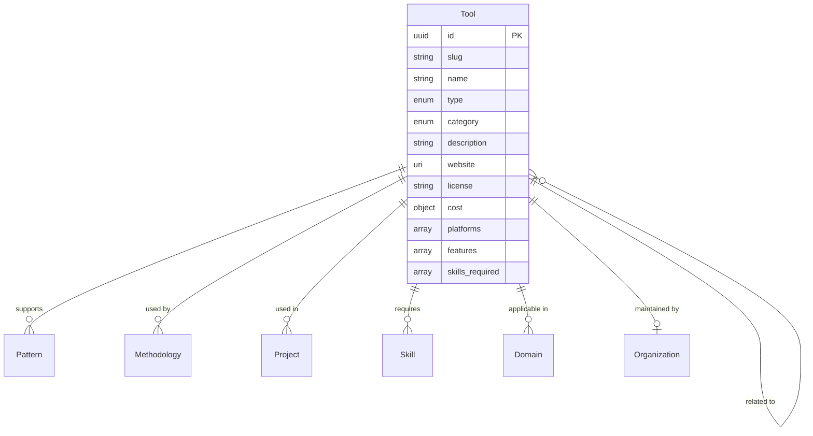

# Tool Entity

## Overview

A Tool represents a tangible or digital instrument, platform, or resource used to support change-making activities within the ChangeMappers ecosystem. Tools provide practical resources for implementing change initiatives.

## Purpose

Tools enable:
- Discovering resources for change-making activities
- Understanding tool capabilities and requirements
- Connecting tools to patterns and methodologies
- Identifying skill requirements for tool use

## Fields

### Core Fields

| Field | Type | Required | Description |
|-------|------|----------|-------------|
| `id` | UUID | Yes | Unique identifier for the tool |
| `slug` | string | Yes | URL-friendly identifier |
| `name` | string | Yes | Name of the tool (1-200 characters) |
| `type` | enum | Yes | Type of tool |
| `created_at` | datetime | Yes | Creation timestamp |

### Tool Types

| Type | Description |
|------|-------------|
| `software` | Software application |
| `platform` | Web platform or service |
| `framework` | Conceptual framework |
| `methodology` | Methodological tool |
| `physical` | Physical tool or device |
| `template` | Template or form |
| `guide` | Guide or manual |
| `database` | Database or dataset |

### Tool Categories

| Category | Description |
|----------|-------------|
| `data_collection` | Data collection tools |
| `analysis` | Analysis tools |
| `communication` | Communication tools |
| `collaboration` | Collaboration tools |
| `visualization` | Visualization tools |
| `mapping` | Mapping tools |
| `monitoring` | Monitoring tools |
| `evaluation` | Evaluation tools |
| `training` | Training tools |
| `advocacy` | Advocacy tools |
| `organizing` | Organizing tools |

### Optional Fields

| Field | Type | Description |
|-------|------|-------------|
| `description` | string | Description of the tool (max 2000 characters) |
| `category` | enum | Category of the tool |
| `website` | URI | Website URL |
| `documentation_url` | URI | Documentation URL |
| `repository_url` | URI | Source code repository URL |
| `license` | string | License type |
| `cost` | object | Cost information (type, pricing_url) |
| `platforms` | array[enum] | Supported platforms |
| `features` | array[string] | Key features |
| `limitations` | array[string] | Known limitations |
| `integration_capabilities` | array[string] | Integration capabilities |
| `use_cases` | array[string] | Common use cases |
| `related_tools` | array[UUID] | Related tools |
| `related_patterns` | array[UUID] | Patterns that use this tool |
| `related_methods` | array[UUID] | Methodologies that use this tool |
| `projects_using` | array[UUID] | Projects using this tool |
| `skills_required` | array[UUID] | Skills required to use |
| `domains` | array[UUID] | Domains where applicable |
| `maintainer` | UUID | Organization maintaining the tool |
| `tags` | array[string] | Freeform tags |
| `metadata` | object | Additional metadata |
| `updated_at` | datetime | Last update timestamp |

### Cost Types

| Type | Description |
|------|-------------|
| `free` | Free to use |
| `freemium` | Free with paid features |
| `paid` | Paid only |
| `open_source` | Open source |

### Platform Options

- `web`
- `windows`
- `macos`
- `linux`
- `ios`
- `android`

## Relationships



## Example Record

```json
{
  "id": "550e8400-e29b-41d4-a716-446655440008",
  "slug": "kobo-toolbox",
  "name": "KoboToolbox",
  "description": "Free and open source suite of tools for field data collection.",
  "type": "platform",
  "category": "data_collection",
  "website": "https://kobotoolbox.org",
  "documentation_url": "https://support.kobotoolbox.org",
  "repository_url": "https://github.com/kobotoolbox",
  "license": "AGPL-3.0",
  "cost": {
    "type": "open_source",
    "pricing_url": null
  },
  "platforms": ["web", "android"],
  "features": [
    "Offline data collection",
    "Multi-language surveys",
    "Photo and GPS capture",
    "Data visualization",
    "API access"
  ],
  "limitations": [
    "Requires internet for initial setup",
    "Limited offline analysis capabilities",
    "Learning curve for complex forms"
  ],
  "integration_capabilities": [
    "Excel/CSV export",
    "Power BI",
    "Tableau",
    "REST API"
  ],
  "use_cases": [
    "Humanitarian needs assessment",
    "Monitoring and evaluation",
    "Community surveys",
    "Research data collection"
  ],
  "related_tools": [],
  "related_patterns": ["550e8400-e29b-41d4-a716-446655440005"],
  "skills_required": [
    "550e8400-e29b-41d4-a716-446655440060"
  ],
  "domains": ["550e8400-e29b-41d4-a716-446655440021"],
  "projects_using": ["550e8400-e29b-41d4-a716-446655440010"],
  "maintainer": "550e8400-e29b-41d4-a716-446655440001",
  "tags": ["data-collection", "survey", "mobile", "open-source"],
  "created_at": "2024-01-15T10:30:00Z",
  "updated_at": "2024-06-20T14:45:00Z"
}
```

## Query Examples

### Find tools by category

```sql
SELECT * FROM tools WHERE category = 'data_collection';
```

### Find free/open source tools

```sql
SELECT * FROM tools 
WHERE cost->>'type' IN ('free', 'open_source');
```

### Find tools by platform

```sql
SELECT * FROM tools 
WHERE platforms @> ARRAY['web']::text[];
```

### Find tools for a domain

```sql
SELECT t.* FROM tools t
JOIN tool_domains td ON t.id = td.tool_id
WHERE td.domain_id = 'domain-uuid-here';
```

### Find tools requiring a skill

```sql
SELECT t.* FROM tools t
JOIN tool_skills ts ON t.id = ts.tool_id
WHERE ts.skill_id = 'skill-uuid-here';
```

## Validation Rules

1. **ID Format**: Must be a valid UUID v4
2. **Slug Format**: Lowercase alphanumeric with hyphens
3. **Name Length**: Between 1-200 characters
4. **Type**: Must be one of the predefined enum values
5. **Category**: Must be one of the predefined enum values
6. **URLs**: Must be valid URIs when provided
7. **Platforms**: Must be valid platform enum values

## Taxonomies

- **Tool Types**: 8 types of tools
- **Tool Categories**: 11 categories
- **Cost Types**: 4 cost classifications
- **Platforms**: 6 platform options

## Usage Guidelines

1. **Type vs Category**: Type describes the tool format, category describes the function
2. **Features vs Use Cases**: Features are capabilities, use cases are applications
3. **Limitations**: Include known constraints honestly
4. **Skills Required**: List minimum and recommended skills
5. **Maintainer**: Reference the primary maintaining organization

## Related Entities

- [Pattern](pattern.md) - Patterns using this tool
- [Skill](skill.md) - Skills required for use
- [Project](project.md) - Projects using the tool
- [Organization](organization.md) - Tool maintainer
- [Domain](../taxonomies/domains.md) - Applicable domains
- [Methodology](methodology.md) - Related methodologies
