# Domain Taxonomy

## Overview

Domains represent broad fields or areas of activity within the ChangeMappers ecosystem. They provide a hierarchical classification system for categorizing initiatives, projects, organizations, and other entities by their primary area of focus.

## Purpose

The Domain taxonomy enables:
- Categorizing entities by their field of work
- Discovering related initiatives across domains
- Understanding domain-specific patterns and tools
- Analyzing cross-domain connections

## Domain Structure

```mermaid
graph TD
    Environment[Environment]
    Environment --> Climate[Climate Action]
    Environment --> Conservation[Conservation]
    Environment --> Energy[Energy]
    Environment --> Agriculture[Agriculture]
    
    Health[Health]
    Health --> PublicHealth[Public Health]
    Health --> MentalHealth[Mental Health]
    Health --> Healthcare[Healthcare Access]
    
    Education[Education]
    Education --> FormalEd[Formal Education]
    Education --> NonFormalEd[Non-Formal Education]
    Education --> Literacy[Literacy]
    
    SocialJustice[Social Justice]
    SocialJustice --> HumanRights[Human Rights]
    SocialJustice --> Gender[Gender Equity]
    SocialJustice --> Racial[Racial Justice]
    
    EconomicDev[Economic Development]
    EconomicDev --> Livelihoods[Livelihoods]
    EconomicDev --> Finance[Financial Inclusion]
    EconomicDev --> Employment[Employment]
    
    Governance[Governance]
    Governance --> Democracy[Democracy]
    Governance --> Transparency[Transparency]
    Governance --> Participation[Participation]
```



## Domain Fields

| Field | Type | Description |
|-------|------|-------------|
| `id` | UUID | Unique identifier |
| `slug` | string | URL-friendly identifier |
| `name` | string | Domain name (1-100 characters) |
| `description` | string | Domain description (max 2000 characters) |
| `parent_domain` | UUID | Parent domain for hierarchy |
| `subdomains` | array[UUID] | Child domains |
| `related_domains` | array[UUID] | Related domains |
| `taxonomy_code` | string | Taxonomy code from changemappers.org |
| `order` | integer | Display order |
| `icon` | string | Icon identifier |
| `color` | string | Color code (hex format) |

## Primary Domains

### Environment

| Subdomain | Description |
|-----------|-------------|
| Climate Action | Climate mitigation and adaptation |
| Conservation | Biodiversity and ecosystem conservation |
| Energy | Renewable energy and efficiency |
| Agriculture | Sustainable agriculture and food systems |
| Water | Water resources and sanitation |
| Waste | Waste management and circular economy |

### Health

| Subdomain | Description |
|-----------|-------------|
| Public Health | Population health and prevention |
| Mental Health | Mental health and psychosocial support |
| Healthcare Access | Healthcare delivery and access |
| Nutrition | Food security and nutrition |
| Disability | Disability rights and inclusion |

### Education

| Subdomain | Description |
|-----------|-------------|
| Formal Education | Primary, secondary, and higher education |
| Non-Formal Education | Community and adult education |
| Literacy | Literacy and basic skills |
| Youth Development | Youth programs and development |
| Early Childhood | Early childhood development |

### Social Justice

| Subdomain | Description |
|-----------|-------------|
| Human Rights | Human rights advocacy and protection |
| Gender Equity | Gender equality and women's rights |
| Racial Justice | Racial equity and anti-racism |
| LGBTQ+ Rights | LGBTQ+ rights and inclusion |
| Indigenous Rights | Indigenous peoples' rights |

### Economic Development

| Subdomain | Description |
|-----------|-------------|
| Livelihoods | Sustainable livelihoods |
| Financial Inclusion | Access to finance and banking |
| Employment | Job creation and worker rights |
| Entrepreneurship | Small business and entrepreneurship |
| Trade | Fair trade and economic justice |

### Governance

| Subdomain | Description |
|-----------|-------------|
| Democracy | Democratic participation |
| Transparency | Government transparency |
| Accountability | Anti-corruption and accountability |
| Civic Engagement | Civic participation |
| Rule of Law | Legal systems and justice |

## Usage Examples

### Assigning domains to an initiative

```json
{
  "domains": [
    "550e8400-e29b-41d4-a716-446655440021",
    "550e8400-e29b-41d4-a716-446655440022"
  ]
}
```

### Querying by domain

```sql
SELECT * FROM initiatives
WHERE domains @> ARRAY['domain-uuid-here']::uuid[];
```

### Finding cross-domain initiatives

```sql
SELECT i.* FROM initiatives i
JOIN initiative_domains id1 ON i.id = id1.initiative_id
JOIN initiative_domains id2 ON i.id = id2.initiative_id
WHERE id1.domain_id = 'domain-1-uuid'
AND id2.domain_id = 'domain-2-uuid';
```

## Domain Relationships

Domains can have relationships:

| Relationship | Description |
|--------------|-------------|
| Parent/Child | Hierarchical relationship |
| Related | Non-hierarchical connection |
| Cross-cutting | Domain that spans multiple areas |

## Taxonomy Codes

Each domain has a unique taxonomy code following the pattern:
- Level 1: `ENV` (Environment)
- Level 2: `ENV-CLI` (Climate Action)
- Level 3: `ENV-CLI-MIT` (Climate Mitigation)

## Guidelines

1. **Primary Domain**: Assign one primary domain
2. **Multiple Domains**: Use for cross-cutting work
3. **Specificity**: Use the most specific applicable subdomain
4. **Related Domains**: Link domains that commonly intersect

## Related Taxonomies

- [Scales](scales.md) - Geographic and organizational scales
- [Functions](functions.md) - Functional roles and purposes
