# Function Taxonomy

## Overview

Functions represent specific roles or purposes that entities serve within the ChangeMappers ecosystem. The Function taxonomy classifies what actors, organizations, and activities do within change processes.

## Purpose

The Function taxonomy enables:
- Understanding roles within change ecosystems
- Identifying needed functions for initiatives
- Mapping functional relationships
- Assessing organizational capacity

## Function Categories



```mermaid
graph TD
    Governance[Governance]
    Governance --> DecisionMaking[Decision Making]
    Governance --> Oversight[Oversight]
    Governance --> Coordination[Coordination]
    
    Operations[Operations]
    Operations --> Implementation[Implementation]
    Operations --> Management[Management]
    Operations --> Logistics[Logistics]
    
    Engagement[Engagement]
    Engagement --> Organizing[Organizing]
    Engagement --> Outreach[Outreach]
    Engagement --> Participation[Participation]
    
    Learning[Learning]
    Learning --> Research[Research]
    Learning --> Evaluation[Evaluation]
    Learning --> Training[Training]
    
    Communication[Communication]
    Communication --> Messaging[Messaging]
    Communication --> Media[Media]
    Communication --> Storytelling[Storytelling]
    
    Mobilization[Mobilization]
    Mobilization --> Advocacy[Advocacy]
    Mobilization --> Campaigning[Campaigning]
    Mobilization --> Coalition[Coalition Building]
    
    Support[Support]
    Support --> Technical[Technical Support]
    Support --> Administrative[Administrative Support]
    Support --> Financial[Financial Support]
    
    Financing[Financing]
    Financing --> Fundraising[Fundraising]
    Financing --> Grantmaking[Grantmaking]
    Financing --> Investment[Investment]
```

## Function Fields

| Field | Type | Description |
|-------|------|-------------|
| `id` | UUID | Unique identifier |
| `slug` | string | URL-friendly identifier |
| `name` | string | Function name (1-100 characters) |
| `description` | string | Function description |
| `category` | enum | Category of function |
| `type` | enum | Type of function |
| `responsibilities` | array[string] | Key responsibilities |
| `activities` | array[string] | Typical activities |
| `skills_required` | array[UUID] | Skills required |
| `related_functions` | array[UUID] | Related functions |
| `parent_function` | UUID | Parent function |
| `child_functions` | array[UUID] | Child functions |
| `patterns` | array[UUID] | Patterns that fulfill this function |
| `methods` | array[UUID] | Methods that fulfill this function |
| `tools` | array[UUID] | Tools that support this function |
| `taxonomy_code` | string | Taxonomy code |

## Function Types

| Type | Description |
|------|-------------|
| `core` | Core/essential function |
| `support` | Supporting function |
| `auxiliary` | Auxiliary/optional function |

## Function Categories

### Governance

Functions related to decision-making and oversight:

| Function | Responsibilities |
|----------|------------------|
| Decision Making | Setting direction, making key decisions |
| Oversight | Monitoring, accountability, compliance |
| Coordination | Aligning activities, managing relationships |
| Strategic Planning | Developing strategies, setting priorities |

### Operations

Functions related to implementation and management:

| Function | Responsibilities |
|----------|------------------|
| Implementation | Executing plans, delivering services |
| Management | Managing staff, resources, timelines |
| Logistics | Supply chain, facilities, equipment |
| Quality Assurance | Ensuring standards, continuous improvement |

### Engagement

Functions related to stakeholder engagement:

| Function | Responsibilities |
|----------|------------------|
| Organizing | Building groups, developing leaders |
| Outreach | Recruitment, awareness raising |
| Participation | Facilitating involvement, inclusion |
| Relationship Building | Maintaining partnerships, networks |

### Learning

Functions related to knowledge and capacity:

| Function | Responsibilities |
|----------|------------------|
| Research | Investigating, analyzing, documenting |
| Evaluation | Assessing impact, outcomes |
| Training | Building skills, transferring knowledge |
| Knowledge Management | Capturing, sharing, applying knowledge |

### Communication

Functions related to messaging and media:

| Function | Responsibilities |
|----------|------------------|
| Messaging | Developing narratives, framing |
| Media | Media relations, content production |
| Storytelling | Capturing and sharing stories |
| Digital Communication | Online presence, social media |

### Mobilization

Functions related to collective action:

| Function | Responsibilities |
|----------|------------------|
| Advocacy | Policy influence, representation |
| Campaigning | Organizing campaigns, actions |
| Coalition Building | Building alliances, partnerships |
| Public Mobilization | Rallies, protests, collective action |

### Support

Functions that support other activities:

| Function | Responsibilities |
|----------|------------------|
| Technical Support | Technical assistance, troubleshooting |
| Administrative Support | Administration, documentation |
| Financial Support | Financial management, accounting |
| Legal Support | Legal advice, compliance |

### Financing

Functions related to financial resources:

| Function | Responsibilities |
|----------|------------------|
| Fundraising | Resource mobilization, donor relations |
| Grantmaking | Awarding grants, managing portfolios |
| Investment | Impact investing, financial planning |
| Budget Management | Financial planning, allocation |

## Usage Examples

### Assigning functions to an organization

```json
{
  "functions": [
    "550e8400-e29b-41d4-a716-446655440024",
    "550e8400-e29b-41d4-a716-446655440025"
  ]
}
```

### Querying by function

```sql
SELECT * FROM organizations
WHERE functions @> ARRAY['function-uuid-here']::uuid[];
```

### Finding entities with similar functions

```sql
SELECT o1.name, o2.name, COUNT(*) as shared_functions
FROM organizations o1
JOIN organization_functions of1 ON o1.id = of1.organization_id
JOIN organization_functions of2 ON of1.function_id = of2.function_id
JOIN organizations o2 ON of2.organization_id = o2.id
WHERE o1.id != o2.id
GROUP BY o1.name, o2.name
ORDER BY shared_functions DESC;
```

## Function Mapping

### Initiative Functions

Identify what functions an initiative needs:

| Initiative Type | Key Functions |
|-----------------|---------------|
| Campaign | Mobilization, Communication, Engagement |
| Coalition | Governance, Coordination, Communication |
| Program | Operations, Learning, Support |
| Network | Coordination, Communication, Support |

### Organization Functions

Map organizational capacity:

| Organization Type | Primary Functions |
|-------------------|-------------------|
| NGO | Implementation, Advocacy, Fundraising |
| Foundation | Grantmaking, Learning, Support |
| Network | Coordination, Communication, Support |
| Community Org | Organizing, Engagement, Operations |

## Guidelines

1. **Primary Function**: Identify the main function(s)
2. **Core vs Support**: Distinguish essential from supporting roles
3. **Multiple Functions**: Most entities serve multiple functions
4. **Skills Mapping**: Connect functions to required skills
5. **Capacity Gap**: Use to identify missing functions

## Related Taxonomies

- [Domains](domains.md) - Areas of activity
- [Scales](scales.md) - Geographic and organizational scales
