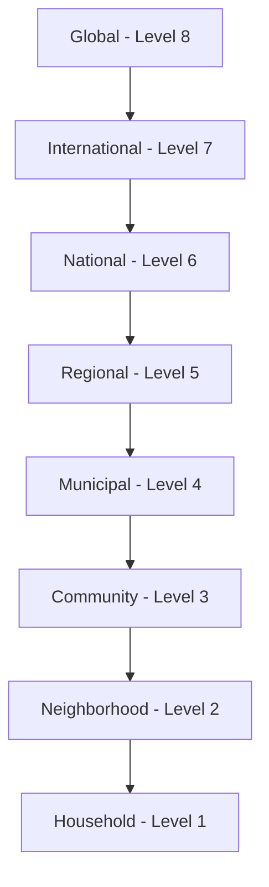

# Scale Taxonomy

## Overview

Scales represent the geographic or organizational scope at which change activities operate. The Scale taxonomy provides a standardized way to describe the reach and level of initiatives, projects, and organizations.

## Purpose

The Scale taxonomy enables:
- Categorizing activities by their scope
- Understanding appropriate strategies for different scales
- Identifying potential for replication and scaling
- Analyzing patterns across different scales

## Scale Hierarchy



## Scale Fields

| Field | Type | Description |
|-------|------|-------------|
| `id` | UUID | Unique identifier |
| `slug` | string | URL-friendly identifier |
| `name` | string | Scale name (1-100 characters) |
| `description` | string | Scale description |
| `level` | integer | Numerical level (higher = broader) |
| `type` | enum | Type of scale |
| `parent_scale` | UUID | Parent scale (broader) |
| `child_scales` | array[UUID] | Child scales (narrower) |
| `population_range` | object | Population range if geographic |
| `geographic_scope` | string | Geographic scope description |
| `examples` | array[string] | Examples at this scale |
| `typical_actors` | array[string] | Typical actors at this scale |
| `typical_organizations` | array[string] | Typical organizations |
| `strategies` | array[string] | Typical strategies |
| `challenges` | array[string] | Typical challenges |
| `opportunities` | array[string] | Typical opportunities |
| `taxonomy_code` | string | Taxonomy code |

## Scale Types

| Type | Description |
|------|-------------|
| `geographic` | Geographic/spatial scale |
| `organizational` | Organizational size/scope |
| `temporal` | Time-based scale |
| `population` | Population-based scale |

## Geographic Scale Levels

### Level 8: Global

| Attribute | Value |
|-----------|-------|
| Population | 8 billion+ |
| Examples | UN agencies, international movements |
| Typical Actors | Global leaders, international figures |
| Strategies | Global advocacy, international cooperation |
| Challenges | Coordination, diverse contexts, resources |

### Level 7: International

| Attribute | Value |
|-----------|-------|
| Population | Varies by region |
| Examples | Regional bodies, cross-border initiatives |
| Typical Actors | Regional coordinators, diaspora |
| Strategies | Regional networks, cross-border collaboration |
| Challenges | Multiple jurisdictions, cultural differences |

### Level 6: National

| Attribute | Value |
|-----------|-------|
| Population | Millions (varies by country) |
| Examples | National campaigns, federal programs |
| Typical Actors | National leaders, politicians |
| Strategies | Policy advocacy, national media |
| Challenges | Political complexity, diverse regions |

### Level 5: Regional

| Attribute | Value |
|-----------|-------|
| Population | Hundreds of thousands to millions |
| Examples | State/provincial programs |
| Typical Actors | Regional coordinators |
| Strategies | Regional networks, multi-city collaboration |
| Challenges | Regional politics, resource allocation |

### Level 4: Municipal

| Attribute | Value |
|-----------|-------|
| Population | Thousands to millions |
| Examples | City programs, local policies |
| Typical Actors | Mayors, city officials |
| Strategies | Local policy, municipal collaboration |
| Challenges | Limited jurisdiction, budget constraints |

### Level 3: Community

| Attribute | Value |
|-----------|-------|
| Population | Hundreds to thousands |
| Examples | Community development projects |
| Typical Actors | Community organizers |
| Strategies | Community organizing, local partnerships |
| Challenges | Limited resources, internal dynamics |

### Level 2: Neighborhood

| Attribute | Value |
|-----------|-------|
| Population | Dozens to hundreds |
| Examples | Block associations, neighborhood groups |
| Typical Actors | Neighborhood leaders |
| Strategies | Door-to-door, small group meetings |
| Challenges | Small scale, volunteer reliance |

### Level 1: Household

| Attribute | Value |
|-----------|-------|
| Population | Individuals to families |
| Examples | Individual actions, family practices |
| Typical Actors | Individuals, family members |
| Strategies | Personal change, family discussions |
| Challenges | Limited impact, isolation |

## Usage Examples

### Assigning scale to an initiative

```json
{
  "scale": "550e8400-e29b-41d4-a716-446655440026"
}
```

### Querying by scale

```sql
SELECT * FROM initiatives
WHERE scale_id = 'scale-uuid-here';
```

### Finding initiatives by scale range

```sql
SELECT i.* FROM initiatives i
JOIN scales s ON i.scale_id = s.id
WHERE s.level BETWEEN 3 AND 5;
```

## Scale Transitions

Activities may move between scales:

| Transition | Description |
|------------|-------------|
| Scaling Up | Expanding to broader scope |
| Scaling Out | Replicating at same scope |
| Scaling Deep | Deepening impact at current scope |

## Scale-Appropriate Strategies

Different scales require different approaches:

| Scale | Best For |
|-------|----------|
| Global | Advocacy, norms, coordination |
| National | Policy, regulation, funding |
| Municipal | Implementation, services, pilots |
| Community | Participation, ownership, adaptation |
| Individual | Behavior change, modeling |

## Guidelines

1. **Primary Scale**: Assign the primary operational scale
2. **Multi-Scale**: Note if activities span multiple scales
3. **Target Scale**: Distinguish current vs. target scale
4. **Population**: Use population_range for geographic scales

## Related Taxonomies

- [Domains](domains.md) - Areas of activity
- [Functions](functions.md) - Functional roles
